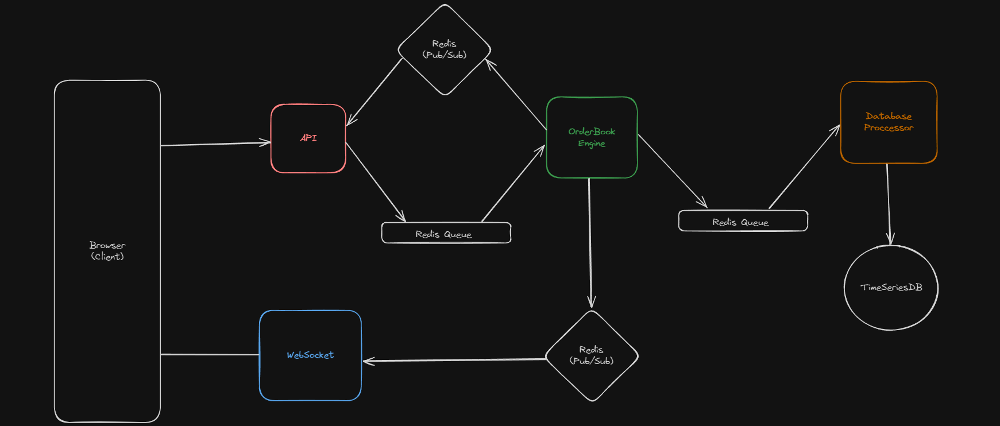

# Exchange

Exchange is a lightweight, real-time stock exchange platform. This repository contains the complete codebase, including frontend, backend, and infrastructure setup.

## Table of Contents

- [Architecture](#architecture)
- [Prerequisites](#prerequisites)
- [Getting Started](#getting-started)
  - [Clone the Repository](#clone-the-repository)
  - [Setup Environment Variables](#setup-environment-variables)
  - [Docker Setup](#docker-setup)
  - [Install Dependencies](#install-dependencies)
  - [Run the Application](#run-the-application)
- [Development](#development)
  - [Backend](#backend)
  - [Frontend](#frontend)
- [Contributing](#contributing)
- [License](#license)

## Architecture

The architecture of the Exchange is designed for scalability and real-time performance:



### Components

1. **Browser (Client)**:
   - Frontend built with Next.js.
   - Interacts with the backend via WebSocket and REST API.

2. **API**:
   - Node.js server that handles REST API requests.
   - Uses Redis for message queuing and pub/sub patterns.

3. **WebSocket Server**:
   - Node.js server using the `ws` library for real-time communication with clients.
   - Subscribes to Redis channels to receive updates.

4. **OrderBook Engine**:
   - Core engine managing the order book.
   - Communicates with Redis for real-time updates.
   - Interacts with Redis queues for order processing.

5. **Database Processor**:
   - Handles persistence of data into a time-series database.
   - Uses Redis queues to receive data for processing.

6. **Redis**:
   - Used for both message queuing and pub/sub patterns.
   - Facilitates real-time messaging and data flow between components.

7. **TimeSeriesDB**:
   - TimescaleDB running on Docker for storing time-series data related to trades and orders.

## Prerequisites

- Docker and Docker Compose
- Node.js and npm

## Getting Started

### Clone the Repository

```bash
git clone https://github.com/your-username/exchange.git
cd exchange
```

## Docker Setup

Ensure Docker is installed and running on your machine. Use Docker Compose to start Redis and TimescaleDB.

```bash
docker-compose up -d
```
## Install Dependencies

Navigate to the respective directories and install the dependencies

```bash
cd api
npm install
cd ../db
npm install
cd ../engine
npm install
cd ../frontend
npm install
cd ../ws
npm install
cd ..
```

## Run the Application

Start the backend, WebSocket server, and frontend servers.

```bash
cd api
npm start
cd ../db
npm start
cd ../engine
npm start
cd ../frontend
npm run dev
cd ../ws
npm start
cd ..
```
## Access the Application

Open your browser and navigate to http://localhost:3000 to access the Exchange frontend.

## Development
### Backend
1. The backend server is built with Node.js.
2. Uses Redis for managing pub/sub and queues.
3. The WebSocket server handles real-time communication with clients.

### Frontend
1. The frontend is built with Next.js.
2. Communicates with the backend via REST API and WebSocket for real-time updates.

## Contributing

Contributions are welcome! Please fork the repository and submit a pull request for any improvements.

## License

This project is licensed under the MIT License.
